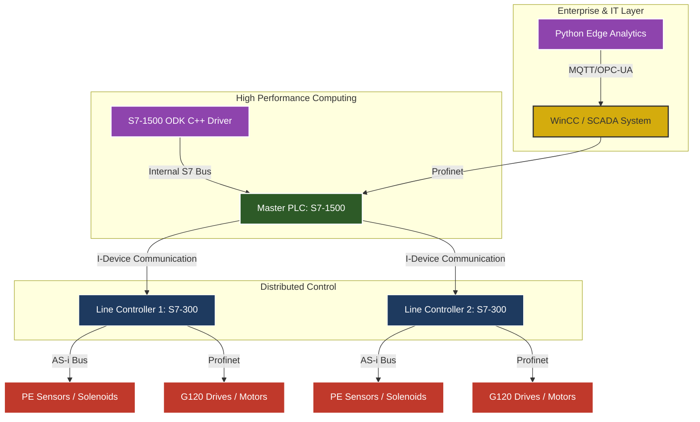
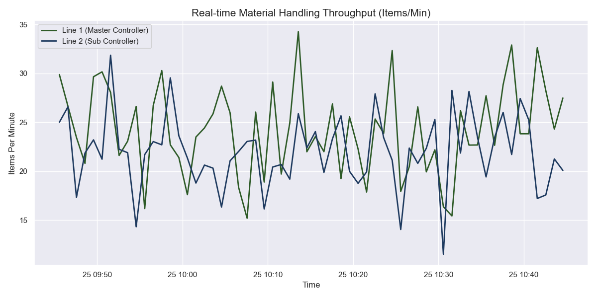

# Distributed Material Handling System using Siemens Multi-PLC Architecture

## Project Overview
This project implements an industrial-grade Baggage Handling System (BHS) using a distributed Siemens PLC architecture. It demonstrates a high-complexity integration of Siemens S7-1500 and S7-300 series controllers, multi-language software development (STL, SCL, C++, Python), and advanced TIA Portal library management.

The system is optimized for high-throughput logistics and airport baggage routing, featuring edge analytics for predictive maintenance and real-time performance monitoring.

---

## Advanced System Architecture
The system utilizes a multi-tier communication and processing model, integrating IT (Information Technology) with OT (Operational Technology).

---

## Real-time Performance Analytics
The following chart represents the simulated material flow throughput from the system, generated using our Edge Analytics Python module. This data is extracted via OPC-UA from the PLC and processed for management reporting.

---

## Multi-Language Engineering Stack
This project showcases the ability to act as a Controls Lead by integrating multiple technical domains:

### 1. Siemens TIA Portal (STL, SCL, LAD)
*   **SCL (Structured Control Language):** Used for advanced data handling, routing tables, and Profinet I-Device data mapping.
*   **STL (Statement List):** Utilized for high-performance bit manipulation and legacy S7-300 interlock compatibility.
*   **Library Management:** Aggressive use of TIA Portal Global Libraries with Version Control (V17/V18) to ensure modularity across R&D projects.

### 2. Embedded C++ (S7-1500 ODK)
*   **S7-1500 Open Development Kit:** Custom C++ driver for high-frequency vibration data pre-processing, enabling predictive maintenance before data reaches the standard PLC cyclic interrupt (OB1).
*   Implementation: `src/cpp_drivers/S7_HighSpeed_Driver.cpp`

### 3. Python (Edge Intelligence)
*   **Predictive Maintenance:** Python scripts for trend analysis and real-time visualization using Matplotlib and Seaborn.
*   **Communication:** Interfacing with PLCs via Snap7 or OPC-UA for data extraction and cloud-readiness.
*   Implementation: `src/edge_analytics/system_monitor.py`

---

## Key Control Features
*   **Multi-PLC Distributed Control:** S7-1500 acts as a Master Routing Controller, managing load balancing for multiple S7-300 Line Controllers.
*   **Bus System Expertise:** Implementation of AS-Interface for digital field sensors and Profinet for high-speed I/O and VFD (G120) control.
*   **Fail-Safe Design:** Heartbeat monitoring and communication watchdog logic to handle Profinet cable breaks or PLC failures without system collision.
*   **R&D Mindset:** Developed a reusable software library for standard conveyor modules (Merge, Divert, Accumulation).

---

## Project Engineering Experience
*   **Requirement Definition:** Translating high-level baggage handling requirements into detailed software specifications.
*   **Risk Mitigation:** Identification of technical risks (congested lanes, sensor failures) and implementation of software-based recovery routines.
*   **Commissioning:** Experience in system integration, site testing, and multicultural stakeholder coordination.

---
Contact: Aftab | Email: [Your Email Address]
