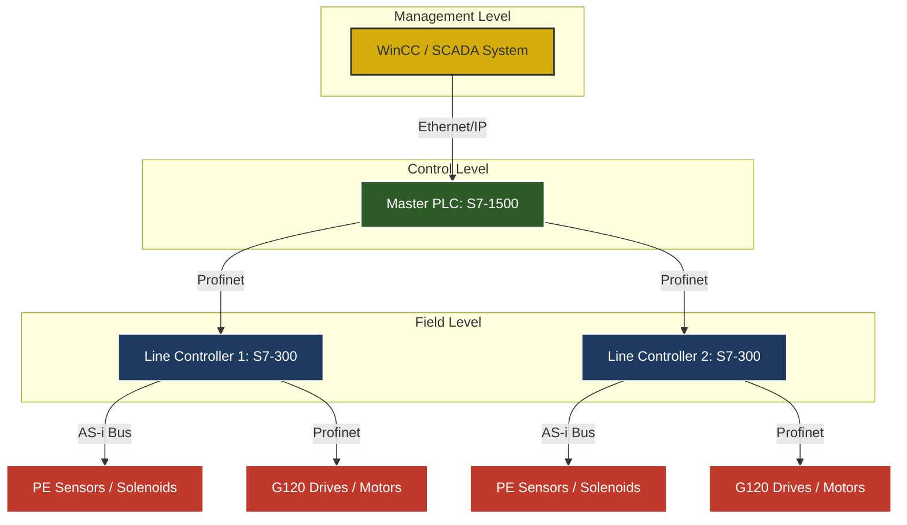

# Distributed Material Handling System using Siemens Multi-PLC Architecture

## Project Overview
This project implements an industrial-grade Baggage Handling System (BHS) using a distributed Siemens PLC architecture. It demonstrates the design, implementation, and commissioning phase of a multi-PLC network consisting of an S7-1500 Master and S7-300 Sub-PLCs, optimized for material flow, routing, and system-level diagnostics.

The system is designed for high-throughput logistics, airport baggage handling, and automated warehousing applications.

---

## System Architecture
The system follows a tiered industrial communication model as illustrated below:

### Key Technical Features
*   Multi-PLC Coordination: S7-1500 manages global routing while S7-300 handles local high-speed conveyor tasks.
*   Standard Software Library: Developed modular Function Blocks (FBs) for Motors, Conveyors, and Diverters to ensure R&D scalability.
*   STL and SCL Implementation: Core interlocks written in Statement List (STL) for performance, and complex routing logic in Structured Control Language (SCL).
*   Network Resilience: Implemented heartbeat-based watchdog logic for Profinet communication failure mitigation.

---

## Repository Structure
*   docs: Engineering documentation (System Architecture, Risk Analysis, Commissioning Checklists).
*   src/plc_standard_lib: TIA Portal reusable library blocks (Motor Control, Zone Accumulation, Diverter).
*   src/plc_core_logic: Main routing algorithms and system state machines.
*   src/scada_hmi: HMI tag dictionaries and alarm matrix for SCADA integration.

---

## Control Logic Highlights

### 1. Smart Routing (SCL)
The system uses a priority-based round-robin merge algorithm to balance load between conveyor lines, preventing bottlenecks in the sortation area.
Implementation: src/plc_core_logic/Main_Routing_Logic.scl

### 2. STL State Machine
A robust statement-list state machine governs the system-level transitions (Idle, Starting, Running, Fault), ensuring deterministic behavior.
Implementation: src/plc_core_logic/State_Machine.stl

### 3. Fault Mitigation
Logic was designed to handle common industrial failures:
*   Jam Detection: Auto-stop upstream zones if a photo-eye is blocked for more than 5 seconds.
*   Feedback Timeout: Monitor solenoid feedback; if transit not reached, trigger diverter alarm.

---

## Project Life Cycle and Experience
This project reflects a complete Project Engineering and Commissioning cycle:
1.  Requirement Definition: Throughput analysis and risk identification.
2.  Software Engineering: Standard library development with an R&D focus.
3.  Integration: Multi-PLC data exchange mapping.
4.  Testing: Virtual commissioning of alarm matrices and throughput dashboards.
5.  Documentation: Creation of site-ready commissioning checklists and naming standards.

---

## Skills Demonstrated
*   Siemens PLCs: Advanced knowledge in S7-1500 and S7-300 series.
*   Languages: Proficient in STL, SCL, and LAD.
*   Bus Systems: Practical application of Profinet and AS-Interface.
*   Leadership: Acting as a Controls Lead, managing system architecture and risk mitigation.
*   Domain: Specialized knowledge in Baggage Handling and Material Handling systems.

---
Contact: Aftab | Email: [Your Email Address]
